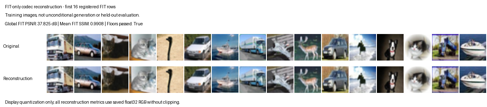

# Real-image codec qualification: FIT reconstruction floors passed

Fresh GPU job **45636236**, seed79201, frozen source `6ae48a91706c97e65c833f94bd51a7b54f74c653`, trained the deterministic RGB codec on exactly4000 registered FIT images. It completed onV100v006, exit0, releasing its allocation after12:06 (worker12:03). All14 GPU preflight tests passed in15.14s. The latent FM field remained entirely untrained.

## Independently recomputed result

| Metric | Result | Registered floor |
|---|---:|---:|
| Global FIT PSNR |37.824835dB|26dB|
| Mean FIT SSIM |0.99077836|0.85|
|16 pooled latent channel standard deviations|all finite and pass|each at least0.001|

CPU audit45638282 completed in1:48, exit0, and ran the two exact prepared checkers after all40 payload hashes and11 source/Git bytes passed authentication. Independent separable Gaussian SSIM differed from the saved per-image values by at most3.03e-14; MSE differed by at most2.17e-19. All18024 minibatch draws and learning rates replayed exactly;91 field-state tensors were unchanged,112 codec-state tensors changed, and frozen codec/field weights matched exactly through normalization. The complete normalized cache had channel-mean error at most1.35e-8 and variance error at most1.07e-7.

Fitting took600.470seconds, including0.470seconds declared overrun. The runner's in-main wall clock was672.933seconds; despite its original `full_standalone_wall_seconds` key, that clock excludes Python imports before main. The actual12:03 worker and12:06 allocation records must also be charged. This boundary correction is explicit and does not change the original records. GPU allocated/reserved peaks are labeled since the fitting reset, not lifetime peaks before initialization. Codec fitting, optimizer startup, both normalization encoding passes, caching and evaluation all remain documented costs.

## What this qualifies

This establishes reconstruction and numerically usable normalization/cache on the **training images only**. It does not establish held-out reconstruction, semantic representation, latent-FM trainability, unconditional generation quality or superiority to a VAE/diffusion/FM. The bottleneck has1024 coordinates versus3072 pixels; it is not an equal-dimensional comparison to the native192-coordinate coarse block or its complete3072-coordinate representation.

The displayed images are reconstructions of the fixed first16 FIT rows, not generated samples. No quality-based image selection or metric clipping occurred. No repair model/statistic/evaluation or official test access was used in this screen; the unchanged loader physically constructs repair arrays, which the runner never consumes.

## Complete retention and compact publication

The full2027-file capture (534,553,188bytes, including staging/import caches) is authenticated and retained locally and on PSC. The original result contains40 hashed payloads plus status.json. Git includes28 original payloads and an exact inventory of12 omitted large payloads (501,528,601bytes), with hashes and both retention locations. The omissions include full4000-image banks, cache and checkpoints; they were audited in full on PSC. This is an explicitly compact publication, not a claim all raw training pixels/weights are in Git.

Original PSC result: `/ocean/projects/mth260022p/ywang26/diffusion-results/20260909-rgb-fit-qualification-6ae48a91`.

Original terminal SHA256: `fb05aeb8cf3f1f95f588c8169d405ef3a1ee0360aeca7cc52e6db39f68577f2d`.

The prepared mathematical/ledger checkers, fabricated selfchecks, complete compact audit records, source snapshots, original gate values and exact omissions are included. A separate fresh full-generation study is still required; seed79201's fitted state will not be recycled as one of its independent fits.
