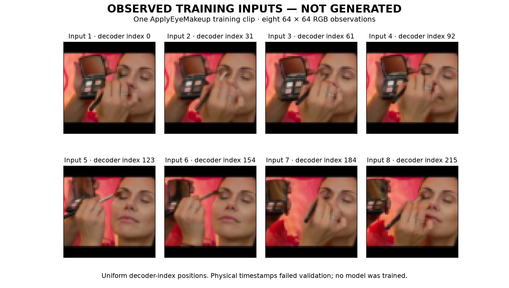

# Observed training-video input artifact, not generated samples

This complete publication package preserves job45580328, the independently audited single-clip normalized decoder-index prerequisite. All eight pictured frames are observed training inputs. No model generated them and no model was trained in this run.

The fixed clip is `UCF101_subset/train/ApplyEyeMakeup/v_ApplyEyeMakeup_g02_c03.avi`. The original physical-timestamp selection failed and remains failed. The distinct index endpoint selects returned decoder indices0,31,61,92,123,154,184,215 from216 authenticated metadata records. It does not establish physical8Hz timing, true presentation order or a repaired timestamp policy. See `INDEPENDENT_REVIEW.md` and `audit.json` for checks and limits.

The complete retrieved result is in `retrieved/20260909-video-index`: original selected RGB arrays, processed64×64 arrays, dequantization noise, float64 cube/logits, float32 logits, Jacobians, frame/selection/provenance metadata, frozen source snapshots, external launch status and captured stdout/stderr. Original submission/preparation commands, monitoring/accounting records, the exact raw retrieval tar and independent audit are retained. The picture is rendered only from the eight saved processed training arrays, with nearest-neighbor display and no image retouching.

`PUBLICATION_SHA256.json` enumerates every file in this publication directory except itself, with byte size and SHA256. Its own bytes are bound by the containing Git commit. No retrieved artifact is omitted; raw transfer and extracted contents are both included deliberately. There are no test/validation clips or additional training clips. No Git-ignore exclusion affects any file; no force-add is needed for the captured logs. This package is an input-feasibility result, not a video-generation or latent-model superiority result.

The standalone audit script is preserved unchanged from its workspace invocation and records its original workspace-relative repository lookup; `audit.json` is the completed independent output. Its numerical resize recomputation used local Pillow12.3.0 against the frozen PSC12.1.0 results and matched the eight arrays exactly. This observed equality is not a general compatibility promise. Original RGB decode was not independently rerun.
